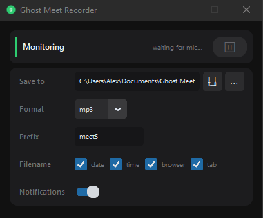

# Ghost Meet Recorder

Automatic audio recorder for Google Meet and other browser-based calls on Windows.

Detects when a browser uses your microphone, starts recording both system audio and mic input, and saves the mixed result when the call ends. Runs silently in the system tray.



## Features

- Auto-detection of browser mic usage (Chrome, Edge, Firefox, Brave, Opera)
- Records system audio + microphone mixed together
- Customizable output format (WAV, MP3, FLAC, OGG, M4A, OPUS, AAC, WMA)
- Customizable filename (prefix, date, time, browser name, tab name)
- Configurable recordings folder
- System tray with minimize-on-close
- Toast notifications on recording start/stop
- Dark modern UI

## Quick Start

**One-click launch:**

```
start.bat
```

This will install dependencies (first run only) and start the app.

**Manual setup:**

```
pip install -r requirements.txt
python main.py
```

## Requirements

- Windows 10/11
- Python 3.10+

## How It Works

### Detection

The app polls Windows audio sessions every 2 seconds via WASAPI (Windows Audio Session API). It checks which processes currently hold the microphone and filters by known browser names (chrome, edge, firefox, brave, opera). When a browser audio session is active, it also grabs the browser window title to use as the tab name in the filename. Since Chrome runs audio in child processes that don't own a window, the detector walks up to the parent process to find the actual tab title.

### Recording

When mic usage is detected, two audio streams open simultaneously:

- **Loopback** (WASAPI) — captures everything playing through your speakers/headphones (the other person's voice)
- **Microphone** — captures your voice

Each stream runs in its own callback powered by PortAudio — audio data arrives in the background and goes into a queue, so nothing gets lost even if the system briefly lags. A separate writer thread pulls one chunk from each queue, downmixes both to mono, resamples the mic to match the loopback sample rate if needed, mixes them together, and writes the result to a WAV file. The result is saved to `Documents/Ghost Meet Recordings/{date}/`.

### Format conversion

Recording always happens in WAV (lossless, no encoding overhead). When a different format is selected in settings, the file is converted after the call ends using a bundled FFmpeg binary (`imageio-ffmpeg` — installed automatically via pip, no manual setup needed).

Supported formats: WAV, MP3, FLAC, OGG, M4A, OPUS, AAC, WMA.
